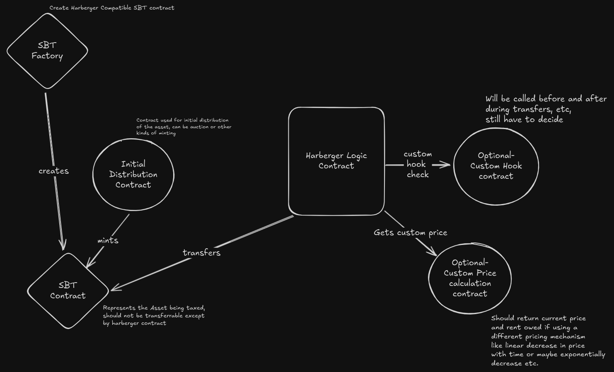

# Problem to Solve
As of today, it is hard for communities and asset owners to value and allocate their resources in an optimal and dynamic way without constant intervention and maintenence. Due to this there is a lot of loss is potential value which can be extracted.

## Summary
To build a **modular** and **open primitive** for Harberger Taxes on the Blockchain, which can be used by anyone to issue and manage Harberger Tax compliant Assets on the blockchain. Which in turn can be used for taxing and extracting value from public and private properties in an efficient way.

## Requirement
- Should be able to accommodate **any mechanism of initial distribution of the assets**
- Should be able to use **custom price determination mechanism** (like linearly decreasing price for finite time period of asset ownership)
- Should have the ability for users to **customise the logic for their own needs using hooks**. (For whitelisting or blacklisting, and other custom logic)

### Technical Details (In work!)

